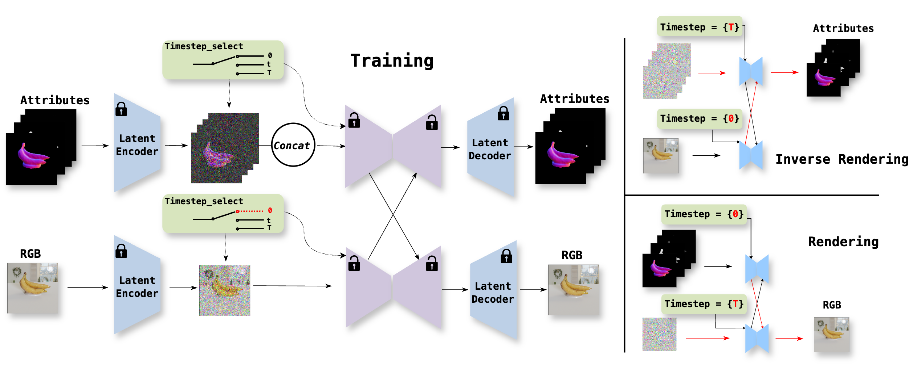
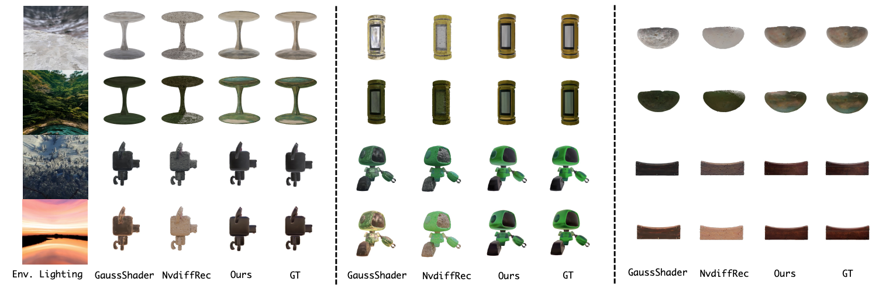
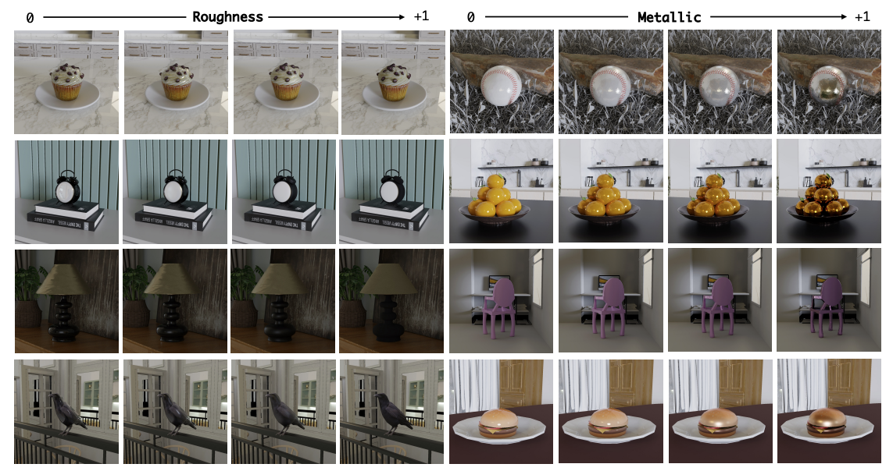

  
# Uni-Renderer: Unifying Rendering and Inverse Rendering Via Dual Stream Diffusion (CVPR2025)

[ZhiFei Chen]()$^{{\*}}$, [Tianshuo Xu]()$^{{\*}}$, [Wenhang Ge]()$^{{\*}}$, [Leyi Wu](), [Dongyu Yan](), [Jing He](), [Luozhou Wang](),[Lu Zeng](), [Shunsi Zhang](), [Yingcong Chen](https://www.yingcong.me)$^{\**}$

HKUST(GZ), HKUST, QuWan Inc.

${\*}$: Equal contribution.
\**: Corresponding author.

<a href="https://arxiv.org/abs/2412.15050"></a>
<a href="https://arxiv.org/abs/2412.15050"></a> 
<a href="#" style="pointer-events: none;"></a>


## 🎏 Introduction

- We introduce the **Uni-Renderer**, a comprehensive framework that unifies both **forward** and **inverse** rendering tasks within a single diffusion-based model. 

<details><summary>CLICK for the full abstract</summary>
Rendering and inverse rendering are pivotal tasks in both computer vision and graphics. The rendering equation is the core of the two tasks, as an ideal conditional distribution transfer function from intrinsic properties to RGB images. Despite achieving promising results of existing rendering methods, they merely approximate the ideal estimation for a specific scene and come with a high computational cost. Additionally, the inverse conditional distribution transfer is intractable due to the inherent ambiguity. To address these challenges, we propose a data-driven method that jointly models rendering and inverse rendering as two conditional generation tasks within a single diffusion framework. Inspired by UniDiffuser, we utilize two distinct time schedules to model both tasks, and with a tailored dual streaming module, we achieve cross-conditioning of two pre-trained diffusion models. This unified approach, named Uni-Renderer, allows the two processes to facilitate each other through a cycle-consistent constraint, mitigating ambiguity by enforcing consistency between intrinsic properties and rendered images. Combined with a meticulously prepared dataset, our method effectively decomposition of intrinsic properties and demonstrates a strong capability to recognize changes during rendering.
</details>


## 💡 Dual-Stream Diffusion Module
By cross-conditioning two pretrained diffusion models through a dual streaming module, we achieve both rendering and inverse rendering in a unified framework.

<div align=center>
 

Overall Architecture 
</div>

## 💡 Religting 
Decomposing a single RGB image into intrinsic properties (e.g., roughness, metallic, albedo, and lighting) using a dual-stream diffusion model, allowing for accurate re-lighting mitigating ambiguity through cycle-consistent constraints.

<div align="center"> 
 

Inverse rendering results
</div>

## 💡 Foward Rendering
Leveraging intrinsic attributes such as material, geometry, and lighting conditions as conditional inputs to a diffusion-based model, which synthesizes photorealistic images without requiring recursive ray tracing.


<div align="center"> 
 

 Rendering/editing results
</div>


## ⚙️ Installation
We recommend using `Python>=3.8.0`, `PyTorch>=2.4.1`, and `CUDA>=12.1`. All build is tested on Ubuntu 20.04 LTS, Python 3.8, CUDA 12.1, NVIDIA A800-SXM4-80GB. 
```bash
conda create -n unirender python==3.8.0
Activate it conda activate unirender.
pip install -U pip

# Install the correct version of CUDA
conda install cuda -c nvidia/label/cuda-12.1.0

# Install PyTorch
pip install torch==2.4.1 torchvision==0.19.1 --index-url https://download.pytorch.org/whl/cu121


# Install diffuser and its dependencies
# The pipeline is running on an older version of diffusers, compatibility problems might exist. We are working to have it updated.
Clone the repo using git clone https://github.com/huggingface/diffusers.git
pip install -e . to install it

# Install SAM and its dependencies
# For real-world inverse rendering, we use SAM2 for obtaining object level masks.
git clone https://github.com/facebookresearch/sam2.git
pip install -e . 

# Install other requirements
pip install -r requirements.txt
```

# 💫 Training

1. We provide our dataset rendering code to facilitate future research. For training data, we used filtered Objaverse for training. Before training, you need to pre-processe the environment maps and OBJ files into formats that fit our dataloader.
2. The .obj file can be downloaded in `https://objaverse.allenai.org/`
3. For environment maps, we used LHQ-1024, which contains 90000 natural images. Please download in `https://disk.yandex.ru/d/jUubeqkT0wbMRg?w=1`.

```bash
# OBJ files to mesh files that can be readed
python obj2mesh.py path_to_obj save_path
```

```bash
# For preprocessing environment maps, please run
python light2map.py path_to_env save_path
```
4. run the training script using `bash train.sh`


## 🚩 Features
- [✅] Release training code.
- [✅] Project page launched.
- [] Release model weights.
- [] Release local gradio demo (more applications).


